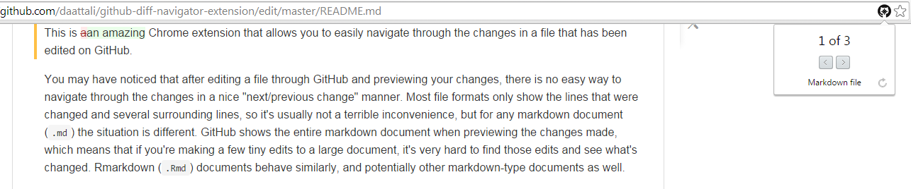
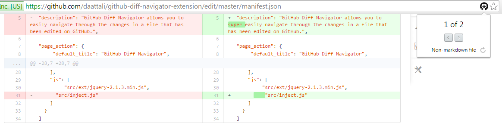
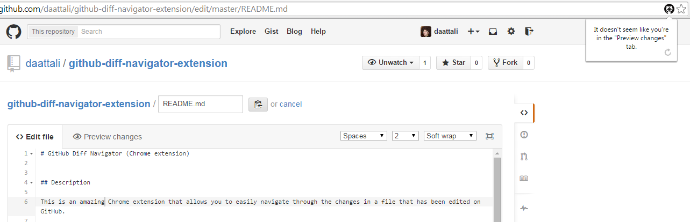
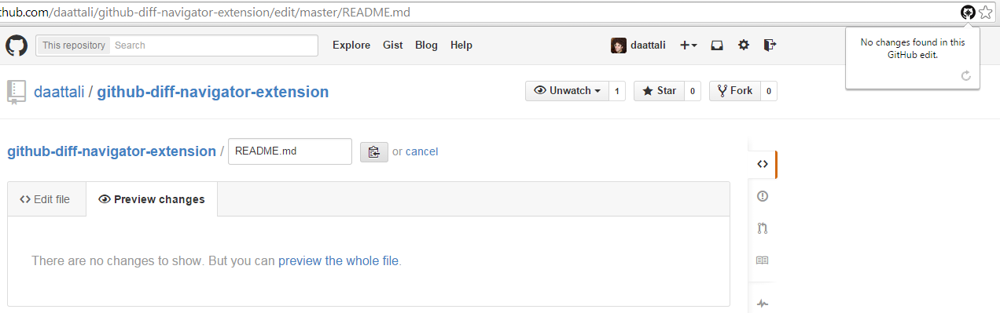

# GitHub Diff Navigator (Chrome extension)

_Dean Attali_    
_December 2014_    
_Source code available [on GitHub](https://github.com/daattali/github-diff-navigator-extension)_     
_Get the extension at the [Chrome Web Store](https://chrome.google.com/webstore/detail/github-diff-navigator/aoojogkiedabnddmokieplfnmjehlneo)_  

## Description

This is a Chrome extension that allows you to easily navigate through the changes in a file that has been edited on GitHub.  

You may have noticed that after editing a file through GitHub and previewing your changes, there is no easy way to navigate through the changes in a nice "next/previous change" manner.
Most file formats only show the lines that were changed and several surrounding lines, so it's usually not a terrible inconvenience, but for any markdown document (`.md`) the situation is different.
GitHub shows the entire markdown document when previewing the changes made, which means that if you're making a few tiny edits to a large document, it's very hard to find those edits and see what's changed.  Rmarkdown (`.Rmd`) documents behave similarly, and potentially other markdown-type documents as well.

Enter: GitHub Diff Navigator.

## Motivation

The idea for this extension came when I was reading through [Hadley Wickham's Advanced R book](http://adv-r.had.co.nz/).
Every time I found a few typos in a chapter (which is a single markdown document), I would edit it on GitHub and make a pull request.  
To make sure I didn't make an idiot out of myself, I wanted to double-check my edits in the Preview tab, but I noticed the problem described above. I didn't trust my eyes in finding the few edits in such large files, and I ended up using the DOM + JavaScript console to help me find where the edits were.  
Then I decided that playing in the JavaScript console wasn't hardcore enough and I decided to spend the next two days making an extension that will help me find such changes quickly in the future.

## Features

- GitHub Diff Navigator is non-intrusive and will only show up when looking at the Preview of edits made on a file using GitHub.    
- GitHub Diff Navigator will not take up any resources or show up in Chrome's Task Manager when you don't have a valid GitHub edited page open.   
- Works with multiple GitHub tabs that are open simultaneously (every time you switch tabs, the extension will update to show you the edits in that tab).   
- Automatically detect whether the file being edited is markdown-type or not, and seamlessly works for both.  
- Clean and intuitive UI with helpful messages shown when no edits are found.

## Disclaimer

I would not advise using my code as a template or resource for learning how to write Chrome extensions.  I learned how to write the extension and fully built it within two days, so I'm not sure what the best practices are and how to properly organize the code.  It was just an excuse to test out how Chrome extensions work.  I also left a little bit of ugly code in there -- please dont judge :)

## Screenshots (from a very early version)

Editing a markdown file  

Editing a json file  

Editing a file but not being on the Preview tab  

Editing a file without making any changes  

## Other extensions

[Smileyfy My Facebook](https://github.com/daattali/smileyfy-my-facebook-extension) - Chrome extension that adds infinite happiness to your Facebook browsing, plus a little bonus rickrolling :) 
